# ABISMO: El Sueño de R'lyeh

Juego de acción en 2D al estilo **Blasphemous** (combate exigente, paradas, altares, jefes y
una atmósfera opresiva) ambientado en el horror cósmico de **H. P. Lovecraft**.
Está hecho con **Unity 6.6**, el **Universal Render Pipeline (URP) 2D** y **C#**.

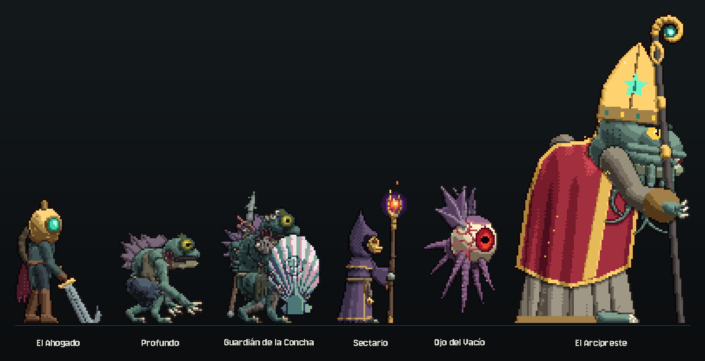

*El Ahogado (jugador), un Profundo, el Guardián de la Concha, un Sectario de Dagón, un Ojo del Vacío y el jefe,
el Arcipreste de las Mareas. Todo el arte —personajes animados fotograma a fotograma, escenarios, fondos,
efectos e interfaz— se pinta por código.*

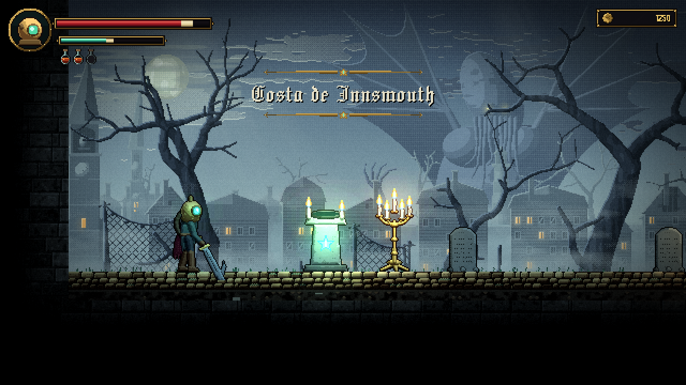

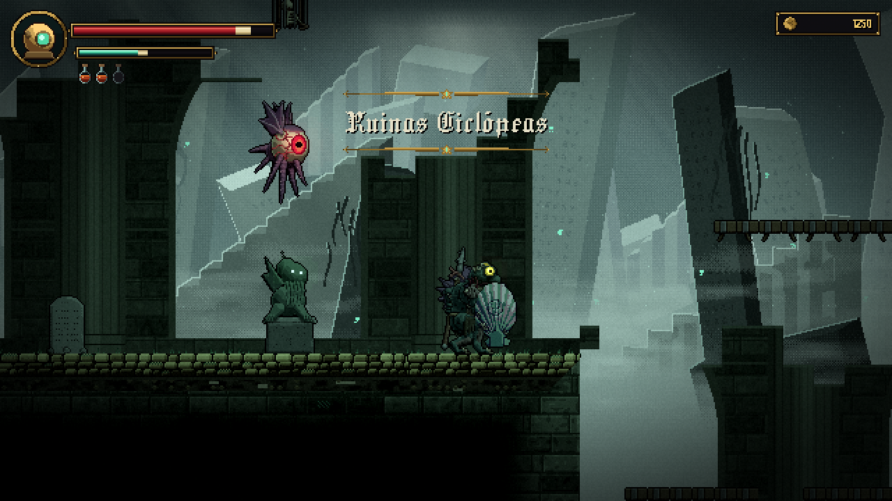

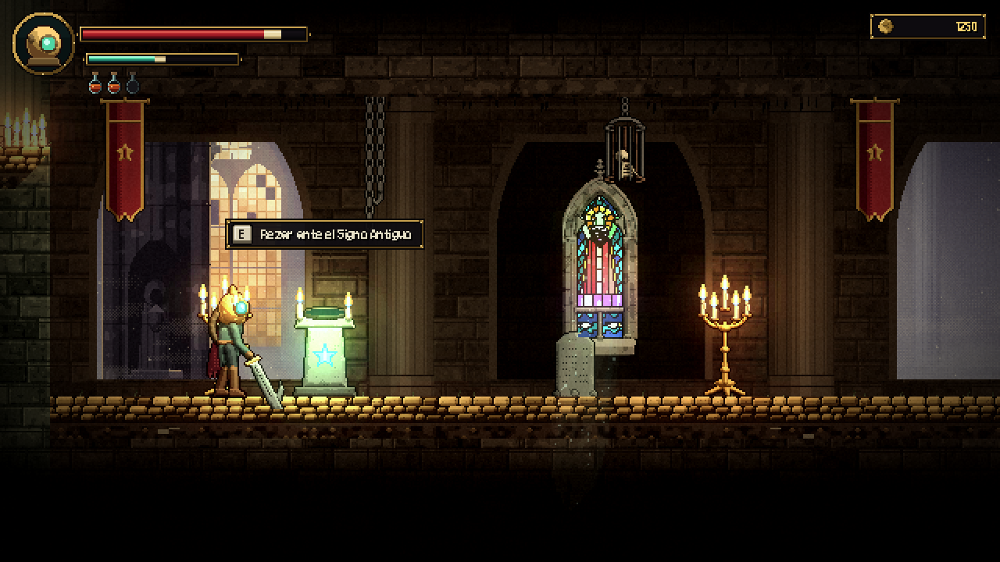

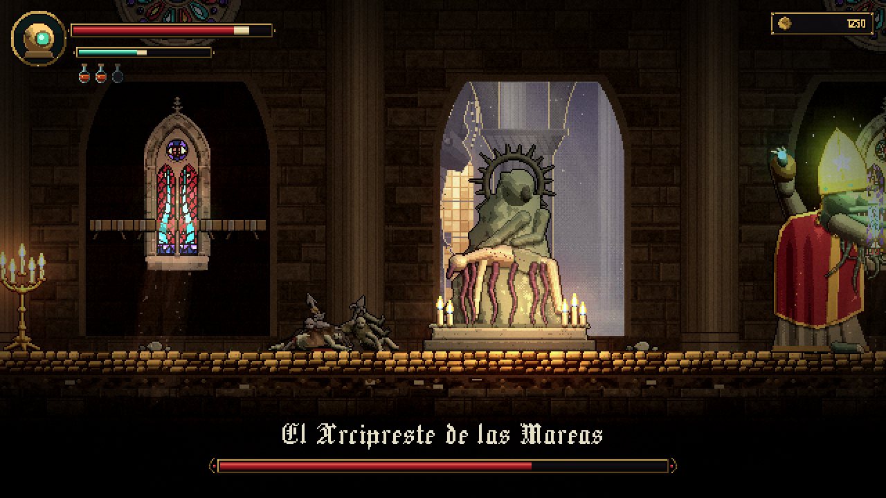

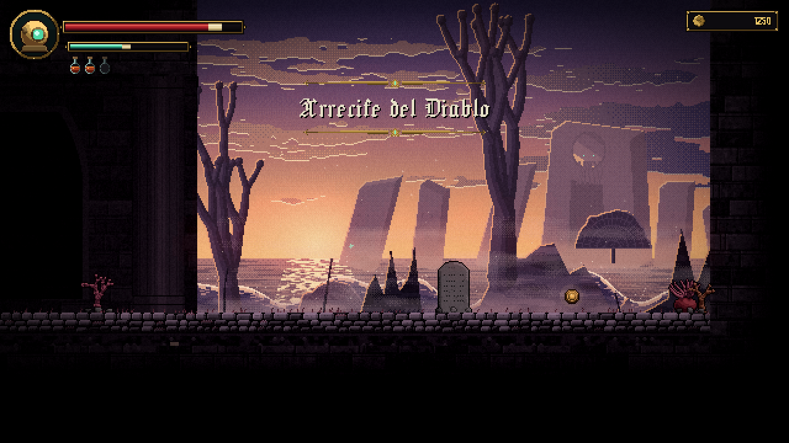

*Vistas previas compuestas fuera de Unity con el mismo arte del juego y una aproximación de su iluminación
(luces 2D, bloom, viñeta). En Unity además hay paralaje, niebla en movimiento, llamas animadas y partículas.*

### El combate

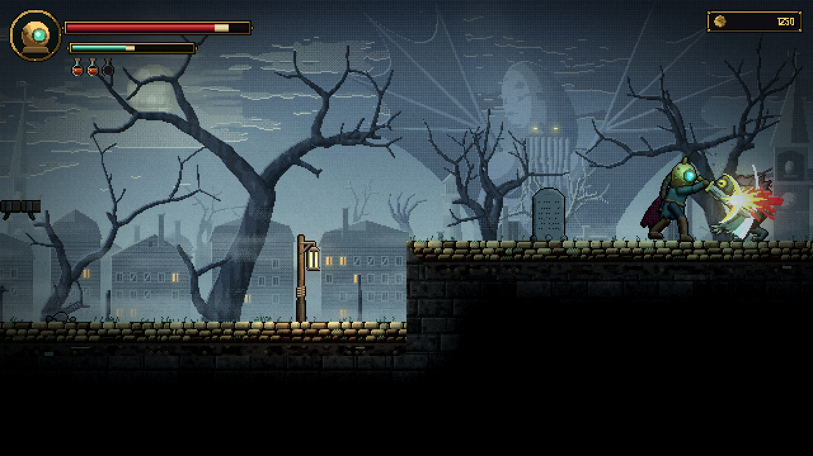

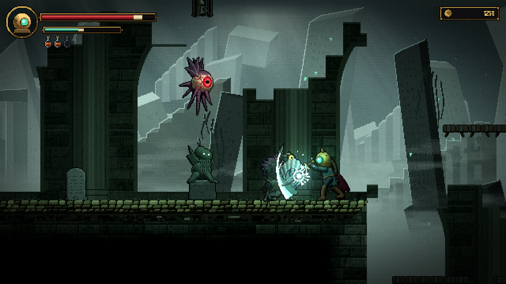

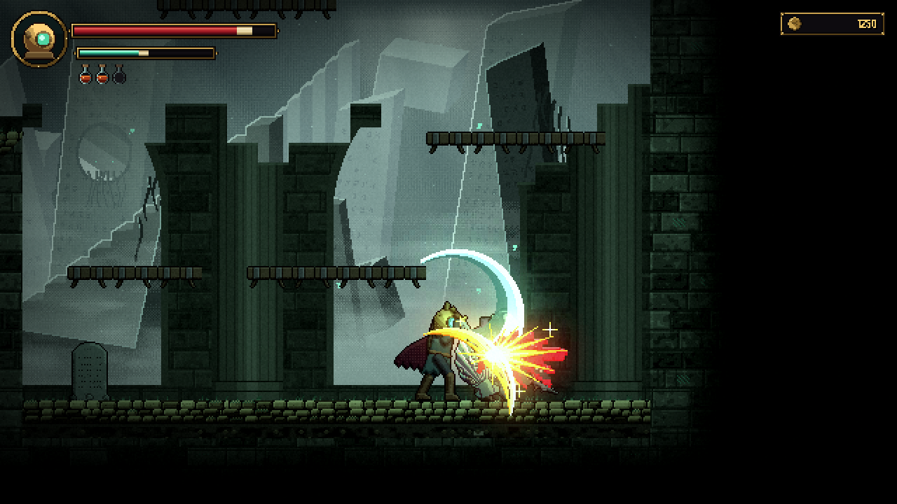

*Arriba: el chispazo y la sangre de cada golpe. En medio: el escudo de nácar del Guardián detiene los golpes de
frente. Abajo: la ejecución de un enemigo aturdido.*

---

## Qué tiene ya la demo

| Blasphemous | Abismo | Estado |
|---|---|---|
| El Penitente | **El Ahogado**, un pescador de Innsmouth con una escafandra de latón | ✅ |
| Combo, esquiva, parada | Combo de 3 golpes, ataque aéreo, deslizamiento invulnerable y **parada** que aturde al enemigo | ✅ |
| Frascos Biliares | **Láudano**: frascos que curan y se rellenan en los altares | ✅ |
| Fervor y oraciones | **Revelación**: se gana golpeando y se gasta en el conjuro **Signo Arcano** | ✅ |
| Reclinatorios | **Altares del Signo Antiguo**: curan y guardan el punto de reaparición, pero las criaturas reviven | ✅ |
| Culpa | **Fragmento de mente**: al morir queda donde caíste y, hasta que lo recuperes, tu Revelación se reduce | ✅ |
| Lágrimas de Expiación | **Oro de Innsmouth** | ✅ |
| Enemigos | Profundo (cuerpo a cuerpo), Sectario (a distancia), Ojo del Vacío (volador) y **Guardián de la Concha**, con un escudo que para los golpes de frente | ✅ |
| Ejecuciones | Ataca a un enemigo **aturdido** para rematarlo con una animación brutal (más Revelación y más oro) | ✅ |
| Golpes que se sienten | **Chispazos**, **sangre**, estrella blanca al recibir daño, chispas al chocar con un escudo, congelación del golpe (*hit-stop*) y temblor | ✅ |
| Jefes | **El Arcipreste de las Mareas**: tentáculos, abanico de esferas, embestida imparable y 2 fases | ✅ |
| Ataques rojos imparables | Brillo **naranja** = se puede parar · Brillo **rojo** = hay que esquivar | ✅ |
| Animación a mano | **Animación fotograma a fotograma** con anticipación, estelas (*smears*) y continuación, en Animator | ✅ |
| Pixel art iluminado | **Luces 2D** de URP: velas, faroles y altares iluminan la piedra gracias a sus **normal maps** | ✅ |
| Atmósfera | **Bloom**, viñeta, grano, niebla, rayos de luz, paralaje por zona y siluetas en primer plano | ✅ |
| Cámara pixel-perfect | 640×360 píxeles de arte escalados sin deformarse (×2 en 720p, ×3 en 1080p, ×6 en 4K) | ✅ |
| Interfaz gótica | Marcos de oro, medallón del personaje, fuentes pixel góticas, aviso de tecla que flota sobre altares y enemigos ("**[E] Rezar**", "**[J] Ejecutar**") y el estandarte **Requiescat in Profundis** al vencer al jefe | ✅ |
| Sonido | Efectos y ambiente sintetizados por código (no hacen falta archivos de audio) | ✅ |

Un nivel completo con 4 zonas y su propio ambiente: **Costa de Innsmouth → Ruinas Ciclópeas →
Santuario de las Mareas (jefe) → Arrecife del Diablo**.

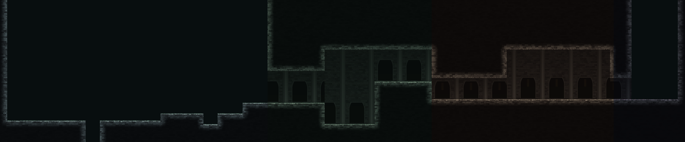

---

## Cómo abrirlo y jugar (paso a paso)

1. **Instala Unity Hub** desde <https://unity.com/download> e inicia sesión con tu cuenta.
2. En Unity Hub ve a **Installs → Install Editor** e instala **Unity 6.6** (6000.6.x, la versión más
   reciente). Para jugar en tu ordenador no necesitas módulos extra.
3. **Descarga este proyecto**: en GitHub pulsa el botón verde **Code → Download ZIP** y descomprímelo
   (o usa `git clone` si ya sabes usar git).
4. En Unity Hub: **Projects → Add → Add project from disk** y elige la carpeta del proyecto
   (la que contiene `Assets`, `Packages` y `ProjectSettings`).
5. Ábrelo con Unity 6.6. La primera vez tarda unos minutos: Unity descarga los paquetes
   (**Universal RP**, **Input System**, **2D Sprite**...). Si te propone actualizar alguna versión, acepta.
6. Si aparece un aviso sobre el **nuevo Input System** ("enable the backends?"), pulsa **Yes**:
   Unity se reiniciará.
7. En la barra de menús de arriba: **Abismo → Construir demo jugable**.
   La primera vez tarda uno o dos minutos: configura URP 2D, pinta todo el arte, crea las animaciones,
   los prefabs y la escena `Assets/_Abismo/Scenes/Nivel_01`, y la abre.
8. Pulsa el botón **▶ (Play)** de arriba del todo. ¡A jugar!

### Controles

| Acción | Teclado | Mando |
|---|---|---|
| Moverse | A / D o flechas | Stick izquierdo / cruceta |
| Saltar (mantén para saltar más) | Espacio o K | A |
| Atacar (hasta 3 golpes) · Ejecutar a un enemigo aturdido | J | X |
| Esquivar deslizándote | L o Shift | B |
| Parar (parry) | I | RB |
| Signo Arcano (gasta Revelación) | U | Y |
| Beber láudano | F | LB |
| Interactuar (rezar, leer) | E o W / ↑ | Cruceta ↑ |
| Bajar de una plataforma | Abajo + Saltar | Abajo + A |
| Pausa (muestra los controles) | Esc | Start |

---

## Cómo se consigue el aspecto "Blasphemous"

Unity 6.5 declaró obsoleto el render pipeline integrado (Built-in), así que el proyecto usa
**URP con el Renderer 2D**, que es además el que permite luces 2D y normal maps en sprites.

- **Pixel art con volumen.** Cada personaje se construye con piezas 2.5D (cápsulas, elipses, polígonos
  biselados). Un pequeño motor (`Editor/Art/ShadedCanvas.cs`) las ilumina por **bandas** con paletas
  de matiz desplazado (sombras frías azul-violeta, luces cálidas), pone **contornos selectivos**,
  **sombras de contacto** y **contraluz** (*rim light*), y además calcula el **normal map** de cada fotograma.
- **Animación con principios clásicos.** Poses clave con curvas de aceleración: el Ahogado anticipa el
  golpe, deja una **estela** curva en el fotograma de impacto y continúa el movimiento; la capa y la
  manguera se mueven con retraso. Los enemigos telegrafían sus ataques con varios fotogramas de aviso.
- **Luz.** Una luz global por zona (verde enfermizo en la costa, ámbar en el santuario...) y luces
  puntuales en velas, faroles, altares, el báculo del jefe y la mirilla de la escafandra. Lo que brilla
  (ojos, brasas, runas, llamas) se dibuja aparte sin iluminar y alimenta el **bloom**.
- **Escenario pintado**, no baldosas repetidas: caminos de **adoquines ocres** con tierra y cascotes debajo,
  sillería que se funde en negro, musgo, columnas y arcos ojivales al fondo (`TerrainPainter.cs`), muros
  **derrumbados** en las Ruinas y arcos abiertos en el Santuario. Encima, el decorado: **vidrieras** que
  brillan con motivos lovecraftianos (un ojo, Dagón, el Signo Antiguo), **pilas de cadáveres** atravesados por
  arpones como en las catedrales de Blasphemous, estatuas, candelabros, estandartes, jaulas y cadenas.
- **Fondos luminosos y brumosos**, con perspectiva atmosférica por capas (`BackgroundArt.cs`): árboles
  muertos y el Durmiente en la niebla tras Innsmouth, monolitos de R'lyeh en bruma verde, una nave dorada con
  un **coloso ahogado encadenado** y un ocaso violeta sobre el Arrecife. Lo oscuro queda para el primer plano.
- **Golpes con peso.** Cada impacto congela el juego unas centésimas, hace temblar la cámara y dispara
  efectos pintados a mano en código (`EffectArt.cs`): el chispazo amarillo-naranja con su media luna, la
  sangre en racimos, la estrella de daño, el estallido del Signo Arcano...

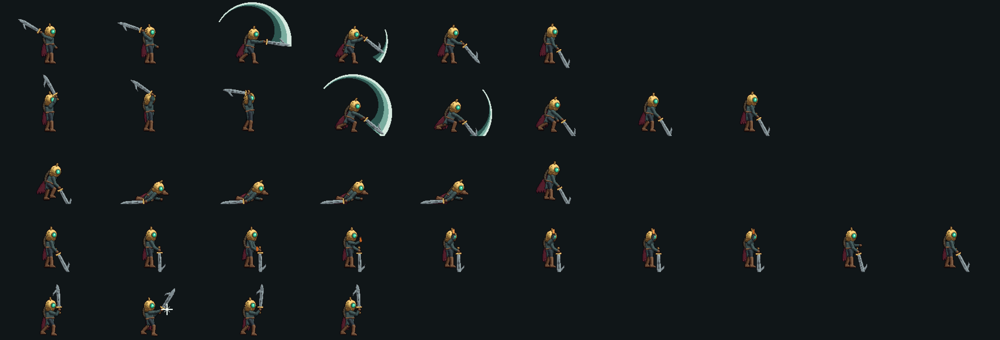

*Algunas animaciones del Ahogado: combo (golpes 1 y 3 con su estela), deslizamiento, láudano y parada.*

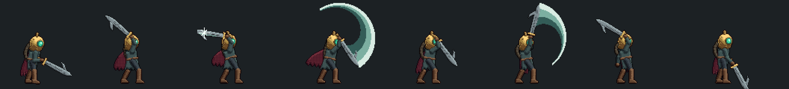

*La ejecución: alza la espada, la clava con una gran estela, la retuerce y la arranca.*

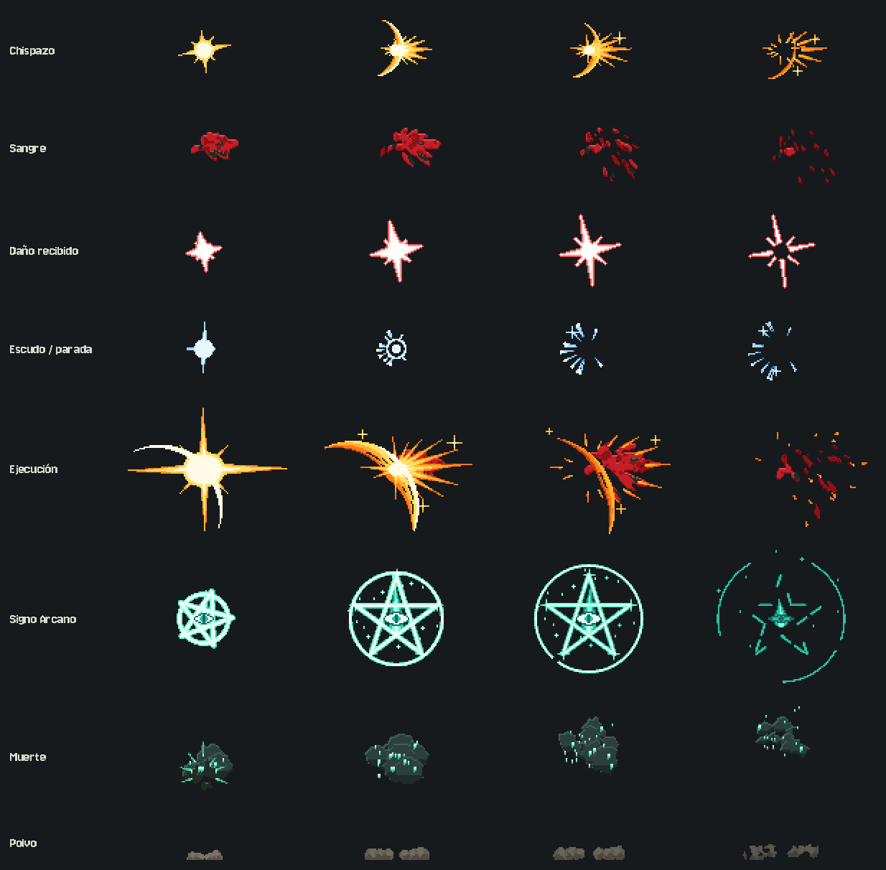

*Los efectos de combate, fotograma a fotograma.*

---

## Cómo está organizado

```
Assets/_Abismo/
├── Scripts/
│   ├── Core/       GameManager, cámara, entrada, combate, efectos (post-procesado reactivo), sonido, animador
│   ├── Player/     PlayerController (movimiento, combate y animaciones), PlayerStats
│   ├── Enemies/    Enemy (base común), Profundo, Guardián de la Concha, Sectario, Ojo del Vacío, Arcipreste, proyectiles...
│   ├── World/      Altares, inscripciones, peligros, oro, paralaje, ambientación por zonas, llamas, brillos
│   └── UI/         HUD (toda la interfaz se crea por código a 640×360)
├── Shaders/        SpriteSilhouette (destellos), SpriteEmissive (partes que brillan), SpriteAdditive (luz)
├── Fonts/          Jacquard 24 y Jersey 10 (fuentes pixel con licencia libre OFL)
├── Editor/
│   ├── Art/        El arte en código: personajes (Characters/), terreno, decorado, vidrieras, fondos, efectos e interfaz
│   ├── Build/      Configuración de URP 2D e importación del arte (hojas de sprites, normal maps, animaciones)
│   └── AbismoBuilder.cs   El menú "Abismo": monta prefabs y la escena
└── Levels/         nivel_01.txt  ← el mapa del nivel, ¡en texto!
```

Al pulsar **Construir** aparecen además `Art/Generated/` (PNG), `Animations/`, `Materials/`, `Prefabs/`,
`Scenes/` y `Settings/` (el pipeline URP 2D y el perfil de post-procesado).

---

## Cómo modificar el juego

**Ajustar el tacto del personaje.** Abre `Assets/_Abismo/Prefabs/Jugador` y en el Inspector cambia
los valores de `PlayerController` (velocidad, altura de salto, daño del combo, ventana de parada...).
Construir respeta tus prefabs; `Abismo → Restablecer prefabs y construir` los vuelve a crear.
(Al actualizar a esta versión, la primera construcción vuelve a crear los prefabs una vez, porque cambian.)

**Diseñar niveles.** Abre `Assets/_Abismo/Levels/nivel_01.txt` con cualquier editor de texto. Cada
carácter es una casilla de 32×32 píxeles (`#` roca, `=` plataforma, `^` coral espinoso, `D` Profundo,
`G` Guardián de la Concha, `A` altar, `S` estatua, `L` candelabro...; la leyenda completa está al principio
del fichero). La línea
`zonas:` del final dice en qué columna empieza cada zona. Guarda y usa **Abismo → Construir demo jugable**:
el terreno se vuelve a pintar a partir del mapa y el decorado pequeño se coloca solo.

**Cambiar la luz y la atmósfera.** En la escena, el objeto `Ambientacion` tiene el color e intensidad
de la luz de cada zona; `Volumen Global` tiene el bloom, la viñeta y el grano; cada vela o altar tiene su
`Light 2D`.

**Cambiar el arte.** Hay dos caminos:
- *Por código:* edita las clases de `Editor/Art` (por ejemplo `Characters/AhogadoArt.cs` tiene las poses
  y animaciones del Ahogado) y vuelve a construir.
- *A mano:* dibuja encima de los PNG de `Assets/_Abismo/Art/Generated` (escala: **32 píxeles = 1 casilla**,
  mismo tamaño y misma posición de los fotogramas) y añade el nombre del archivo a
  `Art/Generated/NO_REGENERAR.txt` para que Construir no lo sobrescriba.

**Crear un enemigo nuevo.** Crea una clase que herede de `Enemy`, escribe su comportamiento en
`Tick(float dt)` y elige su animación con `Animate("nombre")`. Mira `DeepOneEnemy.cs` como ejemplo, y
`GuardianEnemy.cs` para ver cómo se bloquean golpes (`TryBlock`). Para que no se pueda ejecutar, sobrescribe
`Executable`.

---

## Próximos pasos sugeridos

1. Guardar la partida (altar activo, oro, jefes vencidos).
2. Más movimientos: agarrarse a bordes, trepar, golpe hacia abajo.
3. Equipo al estilo de los rosarios y reliquias: **amuletos** que se compran con oro de Innsmouth.
4. Música, más zonas, un mapa y más jefes.

Hay más ideas de historia, enemigos y mecánicas en el [documento de diseño](docs/GDD.md).

---

## Si algo falla

- **No aparece el menú "Abismo"**: hay errores en la ventana **Console** (Window → General → Console).
  Normalmente falta algún paquete: abre **Window → Package Manager** y comprueba que estén instalados
  *Universal RP*, *Input System*, *Unity UI*, *2D Sprite* y *2D Tilemap Editor*.
- **Se ve todo rosa o los sprites no reciben luz**: vuelve a usar **Abismo → Construir demo jugable**,
  que asigna el pipeline `Assets/_Abismo/Settings/Abismo_URP2D` en *Project Settings → Graphics* y en
  *Quality*.
- **Todo se ve negro**: la escena necesita su `Luz Global 2D`; vuelve a construir.
- **El personaje atraviesa el suelo o no hay enemigos**: construye de nuevo; crea las capas `Ground`,
  `Player` y `Enemy` necesarias.
- **Al pulsar Play no pasa nada**: comprueba que tienes abierta la escena `Assets/_Abismo/Scenes/Nivel_01`.

---

*Los textos, el código y el arte de este proyecto son originales. Los nombres del mito (Cthulhu, Dagón,
R'lyeh, Innsmouth) proceden de la obra de H. P. Lovecraft. Fuentes: **Jacquard 24** y **Jersey 10**,
de The Soft Type Project, bajo la SIL Open Font License (ver `Assets/_Abismo/Fonts`).*
